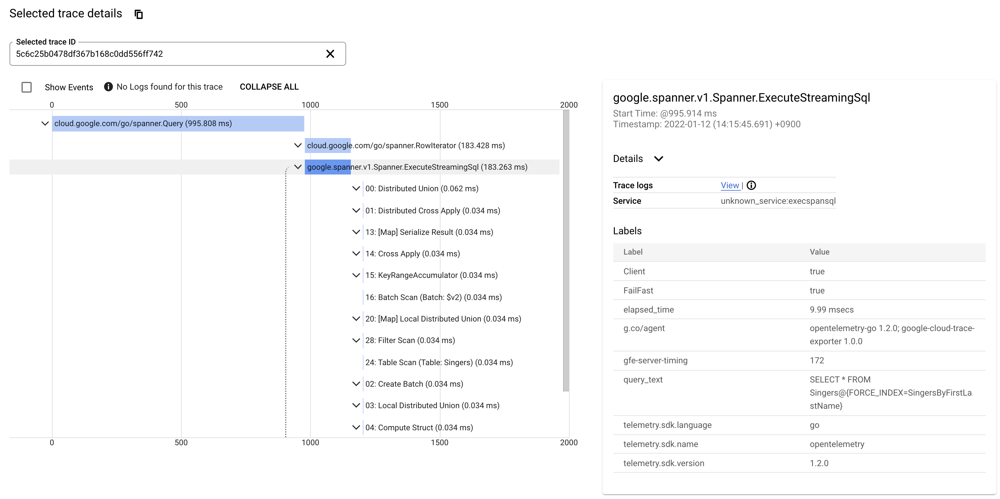

# execspansql

Yet another `gcloud spanner databases execute-sql` replacement for better composability.

## Features

* (Almost) Compatible interface with `gcloud spanner databases execute-sql`
  * Incompatibilities
    * Doesn't support `gcloud config`
* Can receive results of some queries which `gcloud` can't execute
  * Query with query parameters
  * Large result sets over 10MB 
* Embedded jq
* Emit gRPC message logs
* (Experimental) CSV output
* (Experimental) Check whether the query can be executed as a partition query or not.

This tool is still pre-release quality and none of guarantees.

## Usage

Local build requires Go 1.23.

```
$ go install github.com/apstndb/execspansql@latest
```
```
Usage:
  execspansql [OPTIONS] [database]

Application Options:
      --sql=                                   SQL query text; exclusive with --sql-file.
      --sql-file=                              File name contains SQL query; exclusive with --sql
  -p, --project=                               (required) ID of the project. [$CLOUDSDK_CORE_PROJECT]
  -i, --instance=                              (required) ID of the instance. [$CLOUDSDK_SPANNER_INSTANCE]
      --query-mode=[NORMAL|PLAN|PROFILE]       Query mode. (default: NORMAL)
      --format=[json|yaml|experimental_csv]    Output format. (default: json)
      --redact-rows                            Redact result rows from output
  -c, --compact-output                         Compact JSON output(--compact-output of jq)
      --filter=                                jq filter
  -r, --raw-output                             (--raw-output of jq)
      --filter-file=                           (--from-file of jq)
      --param=                                 [name]:[Cloud Spanner type(PLAN only) or literal]
      --log-grpc                               Show gRPC logs
      --experimental-trace-project=
      --enable-partitioned-dml                 Execute DML statement using Partitioned DML
      --timeout=                               Maximum time to wait for the SQL query to complete (default: 10m)
      --try-partition-query                    (Experimental) Check whether the query can be executed as partition query or not

Timestamp Bound:
      --strong                                 Perform a strong query.
      --read-timestamp=TIMESTAMP               Perform a query at the given timestamp. (micro-seconds precision)

Help Options:
  -h, --help                                   Show this help message

Arguments:
  database:                                    (required) ID of the database.
```

You can use container image in GitHub Container Registry.
```
$ docker run --rm -t -e GOOGLE_APPLICATION_CREDENTIALS=/tmp/credentials.json -v "${HOME}/.config/gcloud/application_default_credentials.json:/tmp/credentials.json:ro" \
    ghcr.io/apstndb/execspansql/execspansql:latest -p ${SPANNER_PROJECT} -i ${SPANNER_INSTANCE} ${SPANNER_DATABASE} --sql 'SELECT 1'
# or use specific version
$ docker run --rm -t -e GOOGLE_APPLICATION_CREDENTIALS=/tmp/credentials.json -v "${HOME}/.config/gcloud/application_default_credentials.json:/tmp/credentials.json:ro" \
    ghcr.io/apstndb/execspansql/execspansql:v0.3.3 -p ${SPANNER_PROJECT} -i ${SPANNER_INSTANCE} ${SPANNER_DATABASE} --sql 'SELECT 1'
```

## Notable features

There are examples omitting some required options.

### Parameter support

Many Cloud Spanner clients don't support parameter.
Without modifications, query which have parameters are impossible to execute and query whose parameters' types are `STRUCT` or `ARRAY` are impossible to show query plans.

execspansql supports query parameters.

#### PLAN with complex typed parameters

You can use type syntax to plan a query.

```
$ execspansql ${DATABASE_ID} --query-mode=PLAN \
              --sql='SELECT * FROM UNNEST(@arr) WITH OFFSET' \
              --param='arr:ARRAY<STRUCT<STRING>>'
```
```
$ execspansql ${DATABASE_ID} --query-mode=PLAN \
              --sql='SELECT @str.*' \
              --param='str:STRUCT<FirstName STRING, LastName STRING>'
```

#### PROFILE with complex typed parameterized values 

You can use subset of literal syntax to execute a query.

Note: It only emulates literals and doesn't emulate coercion.

```
$ execspansql ${DATABASE_ID} --query-mode=PROFILE \
              --sql='SELECT * FROM UNNEST(@arr) WITH OFFSET' \
              --param='arr:[STRUCT<pk INT64, col STRING>(1, "foo"), (42, "foobar")]'
```
```
$ execspansql ${DATABASE_ID} --query-mode=PROFILE \
              --sql='SELECT * FROM Singers WHERE STRUCT<FirstName STRING, LastName STRING>(FirstName, LastName) IN UNNEST(@names)' \
              --param='names:[STRUCT<FirstName STRING, LastName STRING>("John", "Doe"), ("Mary", "Sue")]'
```

### Embedded jq

execspansql can process output using embedded [gojq](https://github.com/itchyny/gojq) using `--jq-filter` flag.

#### Example: Extract QueryPlan

[rendertree] command takes QueryPlan, and it can be extracted by jq filter.

```
$ execspansql ${DATABASE_ID} --query-mode=PROFILE --format=json \
              --sql='SELECT * FROM Singers@{FORCE_INDEX=SingersByFirstLastName}' \
              --filter='.stats.queryPlan' \
  | rendertree --mode=PROFILE 
+-----+----------------------------------------------------------------------------+------+-------+------------+
| ID  | Operator                                                                   | Rows | Exec. | Latency    |
+-----+----------------------------------------------------------------------------+------+-------+------------+
|   0 | Distributed Union                                                          |    5 |     1 | 0.47 msecs |
|  *1 | +- Distributed Cross Apply                                                 |    5 |     1 | 0.44 msecs |
|   2 |    +- Create Batch                                                         |      |       |            |
|   3 |    |  +- Local Distributed Union                                           |    5 |     1 | 0.21 msecs |
|   4 |    |     +- Compute Struct                                                 |    5 |     1 | 0.19 msecs |
|   5 |    |        +- Index Scan (Full scan: true, Index: SingersByFirstLastName) |    5 |     1 | 0.18 msecs |
|  13 |    +- [Map] Serialize Result                                               |    5 |     1 | 0.13 msecs |
|  14 |       +- Cross Apply                                                       |    5 |     1 | 0.12 msecs |
|  15 |          +- Batch Scan (Batch: $v2)                                        |    5 |     1 | 0.01 msecs |
|  19 |          +- [Map] Local Distributed Union                                  |    5 |     5 |  0.1 msecs |
| *20 |             +- FilterScan                                                  |    5 |     5 | 0.09 msecs |
|  21 |                +- Table Scan (Table: Singers)                              |    5 |     5 | 0.08 msecs |
+-----+----------------------------------------------------------------------------+------+-------+------------+
Predicates(identified by ID):
  1: Split Range: ($SingerId' = $SingerId)
 20: Seek Condition: ($SingerId' = $batched_SingerId)
```

#### Example: Complex jq filter

[plan.jq](examples/plan.jq) render query plan tree in pure jq.

```
$ execspansql ${DATABASE_ID} --query-mode=PROFILE --format=json \
  --sql='SELECT * FROM Singers@{FORCE_INDEX=SingersByFirstLastName}' \
  --filter-file=examples/plan.jq --raw-output
 *0 Distributed Union
 *1   Distributed Cross Apply
  2     Create Batch
  3       Local Distributed Union
  4         Compute Struct
  5           Index Scan (Full scan: true, Index: SingersByFirstLastName)
 13     [Map] Serialize Result
 14       Cross Apply
 15         Batch Scan (Batch: $v2)
 19         [Map] Local Distributed Union
*20           FilterScan
 21             Table Scan (Table: Singers)
Predicates:
  0: Split Range: true
  1: Split Range: ($SingerId' = $SingerId)
 20: Seek Condition: ($SingerId' = $batched_SingerId)
```

#### Examples from document

[Querying data with a STRUCT object](https://cloud.google.com/spanner/docs/structs?hl=en#querying_data_with_a_struct_object)

```
$ execspansql ${DATABASE_ID} --query-mode=NORMAL \
    --sql='SELECT SingerId FROM SINGERS
           WHERE (FirstName, LastName) = @singerinfo' \
    --param='singerinfo:STRUCT<FirstName STRING, LastName STRING>("Elena", "Campbell")'
```

[Querying data with a STRUCT object](https://cloud.google.com/spanner/docs/structs?hl=en#querying_data_with_an_array_of_struct_objects))

```
$ execspansql ${DATABASE_ID} --query-mode=NORMAL \
    --sql='SELECT SingerId FROM SINGERS
           WHERE STRUCT<FirstName STRING, LastName STRING>(FirstName, LastName)
           IN UNNEST(@names)' \
    --param='names:[STRUCT<FirstName STRING, LastName STRING>("Elena", "Campbell"), ("Hannah", "Harris")]'
```


[Accessing STRUCT field values](https://cloud.google.com/spanner/docs/structs?hl=en#accessing_struct_field_values)

```
$ execspansql ${DATABASE_ID} --query-mode=NORMAL \
    --sql='SELECT SingerId
           FROM Singers
           WHERE FirstName = @name.FirstName' \
    --param='name:STRUCT<FirstName STRING, LastName STRING>("Elena", "Campbell")'
```
```
$ execspansql ${DATABASE_ID} --query-mode=NORMAL \
    --sql='SELECT SingerId, @songinfo.SongName
           FROM Singers
           WHERE STRUCT<FirstName STRING, LastName STRING>(FirstName, LastName) IN UNNEST(@songinfo.ArtistNames)' \
     --param='songinfo:STRUCT<SongName STRING, ArtistNames ARRAY<STRUCT<FirstName STRING, LastName STRING>>>("Imagination", [("Elena", "Campbell"), ("Hannah", "Harris")])'
```

### (Experimental) Cloud Trace integration

```sh
$ execspansql $DATABASE_ID --sql "SELECT * FROM Singers@{FORCE_INDEX=SingersByFirstLastName}" --query-mode=PROFILE --experimental-trace-project=$PROJECT_ID
```



### (Experimental) `--try-partition-query`

Check whether the query can be executed as partition query or not.

```
$ execspansql ${DATABASE_ID} --sql='SELECT * FROM Singers JOIN Albums USING(SingerId)' --try-partition-query
success

$ execspansql ${DATABASE_ID} --sql='SELECT * FROM Singers JOIN Concerts USING(SingerId)' --try-partition-query
2023/08/31 16:43:33 rpc error: code = InvalidArgument desc = Query is not root partitionable since it does not have a DistributedUnion at the root. Please run EXPLAIN for query plan details.
exit status 1
```


## Limitations

* Supports only json and yaml format
