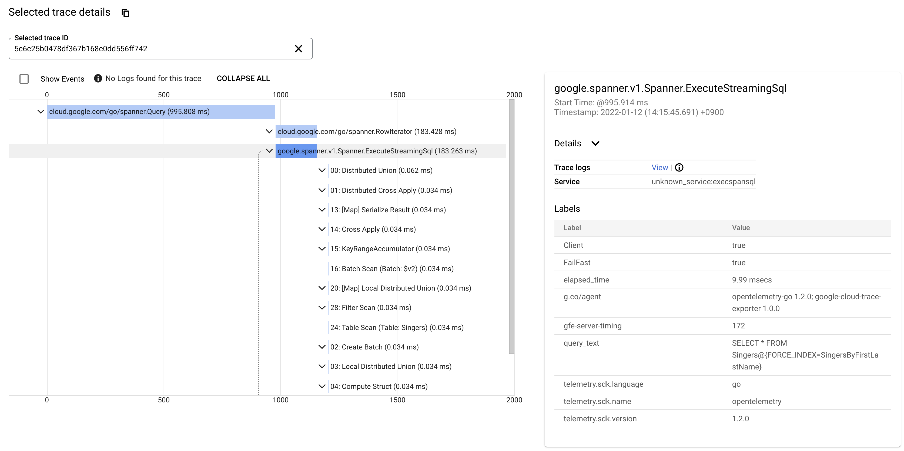

# execspansql

Yet another `gcloud spanner databases execute-sql` replacement for better composability.

## Features

* (Almost) Compatible interface with `gcloud spanner databases execute-sql`
  * Incompatibilities
    * Doesn't support `gcloud config`
* Can receive results of some queries which `gcloud` can't execute
  * Query with query parameters
  * Large result sets over 10MB 
* Embedded jq
* Configurable gRPC logging (`off`, `metadata`, `payload` with payload caveat)
* (Experimental) CSV output
* Split query-plan and row output (`--plan-output`)
* In-process query plan rendering (`--plan-format=text|dot|mermaid|d2|svg|png`)
* (Experimental) Check whether the query can be executed as a partition query or not.

This tool is still pre-release quality and none of guarantees.

## Usage

You can use [released binaries](https://github.com/apstndb/execspansql/releases).
```
Usage: execspansql --sql=STRING --sql-file=STRING <database> [flags]

Yet another gcloud spanner databases execute-sql replacement

Arguments:
  <database>    ID or fully qualified resource name of the database.

Flags:
  -h, --help                       Show context-sensitive help.
      --sql=STRING                 SQL query text; exclusive with --sql-file.
      --sql-file=STRING            File name contains SQL query; exclusive with
                                   --sql
  -p, --project=STRING             ID of the project; required for a database ID
                                   ($CLOUDSDK_CORE_PROJECT).
  -i, --instance=STRING            ID of the instance; required for a database
                                   ID ($CLOUDSDK_SPANNER_INSTANCE).
      --database-role=STRING       Database role to assume for all operations.
      --query-mode="NORMAL"        Query mode: NORMAL, PLAN, PROFILE,
                                   WITH_PLAN_AND_STATS, or WITH_STATS.
      --priority="unspecified"     Priority for the execute SQL request.
      --format="json"              Output format of the primary document.
  -o, --output="-"                 Destination of the primary document. Use -
                                   for stdout; /dev/stdout and /dev/stderr are
                                   mapped in-process.
      --plan-output=STRING         Write the query-plan artifact here and strip
                                   stats.queryPlan from the primary document.
                                   Enables split mode.
      --plan-format=STRING         Format of the plan artifact: json, yaml,
                                   text, dot, mermaid, d2, svg, or png. Defaults
                                   to --format when that is json or yaml,
                                   otherwise json. Requires --plan-output.
      --discard-results            Do not write the primary document
                                   (plan-only). Requires --plan-output.
      --redact-rows                Redact result rows from output
  -c, --compact-output             Compact JSON output (--compact-output of jq)
      --filter=STRING              jq filter
  -r, --raw-output                 (--raw-output of jq)
      --filter-file=STRING         (--from-file of jq)
      --jq-input-mode="eager"      How query rows are passed to jq (json/yaml
                                   only): eager (full ResultSet), lazy (JQValue
                                   root).
      --param=PARAM,...            [name]=[type or literal]; legacy [name]:[...]
                                   also accepted
      --param-file=STRING          YAML or JSON file of query parameters (name
                                   to type/literal string)
      --log-grpc                   gRPC logging: --log-grpc means payload;
                                   use --log-grpc=off|metadata|payload to select
                                   a mode (payload may include request and
                                   response payloads)
      --experimental-trace-project=STRING
                                   Export traces to Cloud Trace in the given
                                   project.
      --experimental-trace-stdout
                                   Export spans to stderr as pretty JSON (local
                                   debugging).
      --experimental-trace-otlp    Export spans via OTLP/gRPC to a local
                                   OpenTelemetry collector.
      --experimental-trace-otlp-endpoint="localhost:4317"
                                   OTLP/gRPC endpoint used with
                                   --experimental-trace-otlp.
      --enable-partitioned-dml     Execute DML statement using Partitioned DML
      --timeout=10m                Maximum time to wait for the SQL query to
                                   complete
      --reauth="off"               When auto, run gcloud application-default
                                   login once if local user ADC needs
                                   reauthentication; off only prints a hint
                                   ($EXECSPANSQL_REAUTH).
      --try-partition-query        (Experimental) Check whether the query can be
                                   executed as partition query or not

Plan rendering
  --plan-text-style=STRING    Text plan style: current, traditional, or compact.
                              Defaults to current. Requires --plan-format=text.
  --plan-wrap-width=INT       Wrap width for text plans. 0 disables wrapping.
                              Requires --plan-format=text.
  --plan-print=STRING         Text plan sections: basic, enhanced, full, none,
                              or a comma-separated section list. Defaults to
                              basic. Requires --plan-format=text.
  --plan-full                 Include full graph node detail. Requires a graph
                              --plan-format (dot, mermaid, d2, svg, png).
  --plan-show-query           Add a query-text node to graph output. Requires a
                              graph --plan-format.
  --plan-show-query-stats     Add query statistics to the query-text node.
                              Requires a graph --plan-format.

Timestamp Bound
  --strong                   Perform a strong query.
  --read-timestamp=STRING    Perform a query at the given timestamp.
                             (micro-seconds precision)
```

Local build requires Go 1.25.

```
$ go install github.com/apstndb/execspansql@latest
```

You can use container image in GitHub Container Registry.
```
$ docker run --rm -t -v "${HOME}/.config/gcloud/application_default_credentials.json:/home/nonroot/.config/gcloud/application_default_credentials.json:ro" \
    ghcr.io/apstndb/execspansql/execspansql:latest -p ${SPANNER_PROJECT} -i ${SPANNER_INSTANCE} ${SPANNER_DATABASE} --sql 'SELECT 1'
# or use specific version
$ docker run --rm -t -v "${HOME}/.config/gcloud/application_default_credentials.json:/home/nonroot/.config/gcloud/application_default_credentials.json:ro" \
    ghcr.io/apstndb/execspansql/execspansql:vX.Y.Z -p ${SPANNER_PROJECT} -i ${SPANNER_INSTANCE} ${SPANNER_DATABASE} --sql 'SELECT 1'
```

## Database resource names

Pass either a database ID with `--project` and `--instance`, or a fully qualified resource name:

```sh
execspansql projects/my-project/instances/my-instance/databases/my-database --sql='SELECT 1'
```

A fully qualified name supplies all three IDs and takes precedence over `--project`, `--instance`, and their `CLOUDSDK_CORE_PROJECT` / `CLOUDSDK_SPANNER_INSTANCE` environment defaults. A short database ID still requires project and instance flags or environment values. As before, gcloud configuration files are not read.

## Notable features

There are examples omitting some required options.

### Database role

Use `--database-role` to assume a Spanner database role for every operation in the command:

```
$ execspansql ${DATABASE_ID} --project=${SPANNER_PROJECT} --instance=${SPANNER_INSTANCE} \
    --database-role=report_reader --sql='SELECT * FROM Singers'
```

### Query modes

`--query-mode` matches gcloud's query-stat modes. `NORMAL` returns result rows only; `PLAN` returns the plan without rows or execution statistics; `PROFILE` returns rows, a plan, overall statistics, and operator-level statistics. `WITH_PLAN_AND_STATS` returns rows, a plan, and overall statistics without operator-level statistics. `WITH_STATS` returns rows and overall statistics without a plan or operator-level statistics.

Only `PLAN` accepts bare parameter type expressions such as `ARRAY<STRING>`; the other modes execute the query and require parameter values.

### Split plan and row output

Setting `--plan-output` switches from the default combined document to split mode. The default (no `--plan-output`) stays a single combined `ResultSet` (or CSV of rows) on stdout, byte-for-byte identical to previous versions.

| Flag | Default | Meaning |
|------|---------|---------|
| `--output PATH` (`-o`) | `-` | Destination of the primary document (metadata, rows, `stats` without `queryPlan`). |
| `--plan-output PATH` | unset | Enables split mode: write the plan artifact here and remove `stats.queryPlan` from the primary document. |
| `--plan-format json\|yaml\|text\|dot\|mermaid\|d2\|svg\|png` | follows `--format` when that is `json` or `yaml`, otherwise `json` | Format of the plan artifact. `json`/`yaml` write a `ResultSet` envelope; the others render in-process. |
| `--discard-results` | off | Do not write the primary document (plan-only). Requires `--plan-output`. |

`--redact-rows` is independent of `--discard-results`: redact still emits metadata and a CSV header; discard writes no primary bytes at all.

Path conventions for both `--output` and `--plan-output`:

- `-` means stdout.
- `/dev/stdout` and `/dev/stderr` are recognized literally and mapped to stdout/stderr in-process (so they work on Windows and take part in collision checks). `--plan-output=/dev/stderr` is the supported spelling for "plan on the terminal while rows go down the pipe".
- Any other value is a regular file. Files are written to a sibling temp file (mode `0600`) and renamed into place after the query (and transaction) succeeds, so a failing query leaves an existing target intact. Overwriting an existing target is allowed. Two files plus stdout are not a transaction: if publishing the second file fails, the command reports which outputs completed and exits non-zero. SQL is never replayed because an output failed.

In split mode the two destinations must differ. Both on stdout (any spelling) is rejected. `--plan-output` requires `--query-mode=PLAN`, `PROFILE`, or `WITH_PLAN_AND_STATS` (never upgraded from `NORMAL` or `WITH_STATS`). It is incompatible with `--try-partition-query` and `--enable-partitioned-dml`.

Document contents:

- Primary document: the current `ResultSet` with `stats.queryPlan` removed. `stats.queryStats` and `stats.rowCount*` stay. CSV primary output is unchanged (rows only).
- Plan artifact: a `ResultSet` envelope without `rows` — `metadata` (for `rowType`) plus the full `stats` (`queryPlan`, `queryStats`, `rowCount*`). jq flags apply only to the primary document; the plan is never filtered.

Split mode disables jq early stop: remaining rows are drained so the final plan/stats can be captured, at the same server cost as reading everything. Rows drained only for the plan are not retained. `--jq-input-mode=lazy` still caches rows that jq actually consumed.

If output or rendering fails after a committed DML statement, the process exits non-zero and says so. That failure is not a rollback and the SQL is not replayed.

```
$ execspansql ${DATABASE_ID} --query-mode=PROFILE --format=experimental_csv \
    --output=- --plan-output=/dev/stderr \
    --sql='SELECT * FROM Singers'
```

```
$ execspansql ${DATABASE_ID} --query-mode=PROFILE \
    --output=rows.yaml --format=yaml --plan-output=plan.json --plan-format=json \
    --sql='SELECT * FROM Singers'
```

```
$ execspansql ${DATABASE_ID} --query-mode=PROFILE --discard-results \
    --plan-output=plan.json --sql='SELECT * FROM Singers'
```

Renderer formats write through the same `--plan-output` sink. `--plan-format=text` is the built-in equivalent of piping `.stats.queryPlan` into `rendertree`. Graph formats (`dot`, `mermaid`, `d2`, `svg`, `png`) use embedded `spannerplanviz`; `svg`/`png` do not need an external Graphviz install.

| Flag | Applies to | Default |
|------|------------|---------|
| `--plan-text-style current\|traditional\|compact` | `text` | `current` |
| `--plan-wrap-width N` | `text` | `0` (off; never inferred from terminal width) |
| `--plan-print basic\|enhanced\|full\|none\|<sections>` | `text` | `basic` |
| `--plan-full` | graph formats | off |
| `--plan-show-query` | graph formats | off |
| `--plan-show-query-stats` | graph formats | off |

`--redact-rows` does not redact plans: predicates and metadata can still contain literals. `png` to a terminal (`--plan-output=-` or `/dev/stderr` when that fd is a TTY) is rejected; redirect or write a file instead. Renderer-only flags that do not apply to the chosen `--plan-format` are errors, not silent no-ops.

```
$ execspansql ${DATABASE_ID} --query-mode=PROFILE --format=experimental_csv \
    --output=- --plan-output=/dev/stderr --plan-format=text \
    --sql='SELECT * FROM Singers'
```

```
$ execspansql ${DATABASE_ID} --query-mode=PROFILE --redact-rows \
    --discard-results --plan-output=- --plan-format=text \
    --sql='SELECT * FROM Singers'
```

```
$ execspansql ${DATABASE_ID} --query-mode=PROFILE --discard-results \
    --plan-output=plan.svg --plan-format=svg --plan-full \
    --sql='SELECT * FROM Singers'
```

### Parameter support

Many Cloud Spanner clients don't support parameter.
Without modifications, query which have parameters are impossible to execute and query whose parameters' types are `STRUCT` or `ARRAY` are impossible to show query plans.

execspansql supports query parameters via repeated `--param name=value` flags (legacy `name:value` is also accepted) or a `--param-file` (YAML or JSON). When both are given, `--param` overrides entries from the file.

#### PLAN with complex typed parameters

You can use type syntax to plan a query.

```
$ execspansql ${DATABASE_ID} --query-mode=PLAN \
              --sql='SELECT * FROM UNNEST(@arr) WITH OFFSET' \
              --param='arr=ARRAY<STRUCT<STRING>>'
```
```
$ execspansql ${DATABASE_ID} --query-mode=PLAN \
              --sql='SELECT @str.*' \
              --param='str=STRUCT<FirstName STRING, LastName STRING>'
```

#### Parameters from a file

`--param-file` accepts YAML or JSON (`.json` extension selects JSON; otherwise YAML). Values are the same type/literal strings used with `--param`.

```yaml
# params.yaml
arr: '["foo", "bar"]'
```

```
$ execspansql ${DATABASE_ID} --query-mode=PROFILE \
              --sql='SELECT * FROM UNNEST(@arr) WITH OFFSET' \
              --param-file=params.yaml
```

#### PROFILE with complex typed parameterized values 

You can use subset of literal syntax to execute a query.

Note: It only emulates literals and doesn't emulate coercion.

```
$ execspansql ${DATABASE_ID} --query-mode=PROFILE \
              --sql='SELECT * FROM UNNEST(@arr) WITH OFFSET' \
              --param='arr=[STRUCT<pk INT64, col STRING>(1, "foo"), (42, "foobar")]'
```
```
$ execspansql ${DATABASE_ID} --query-mode=PROFILE \
              --sql='SELECT * FROM Singers WHERE STRUCT<FirstName STRING, LastName STRING>(FirstName, LastName) IN UNNEST(@names)' \
              --param='names=[STRUCT<FirstName STRING, LastName STRING>("John", "Doe"), ("Mary", "Sue")]'
```

### Embedded jq

execspansql can process output using embedded [wader/gojq](https://github.com/wader/gojq) (jq-compatible; includes `JQValue` for lazy inputs) using `--filter` flag.

`--jq-input-mode` controls how results are passed to jq (json/yaml only):

| Mode | Input | Typical filter |
|------|--------|----------------|
| `eager` (default) | Full ResultSet object | `.`, `.stats.queryPlan` |
| `lazy` | `JQValue` root (`metadata` / `rows` Iter / `stats`) | `.rows[]`, `.stats.queryPlan` |

In `lazy` mode, `metadata` is populated after the first row is read from Spanner (or after a zero-row result). Prefer `.rows[]` to stream rows. Bare `.rows` is a lazy iterator: reuse it in one object literal (for example `{a: .rows, b: .rows}`) may not duplicate rows because jq can evaluate the subexpression once; use `{a: [.rows[]], b: [.rows[]]}` when you need two row arrays. After `.stats` drains the iterator, captured `.rows` values replay from materialized rows.

`--jq-input-mode=lazy` emits rows incrementally, but rows are cached internally after first materialization and reused, so it is not a strict constant-memory mode for large result sets. Split mode (`--plan-output`) disables jq early stop: remaining rows are still drained so the plan artifact can be written.

Output expands top-level `gojq.Iter` to one JSON/YAML document per row (JSONL-style). Nested `Iter` values inside objects are expanded to arrays on encode.

#### Example: Extract QueryPlan

`--plan-output` with `--plan-format=text` renders the plan without a second binary. The jq + [rendertree] pipeline remains available for the combined document.

```
$ execspansql ${DATABASE_ID} --query-mode=PROFILE \
              --sql='SELECT * FROM Singers@{FORCE_INDEX=SingersByFirstLastName}' \
              --discard-results --plan-output=- --plan-format=text
```

[rendertree] can still consume `.stats.queryPlan` from the combined JSON document:

```
$ execspansql ${DATABASE_ID} --query-mode=PROFILE --format=json \
              --sql='SELECT * FROM Singers@{FORCE_INDEX=SingersByFirstLastName}' \
              --filter='.stats.queryPlan' \
  | rendertree --mode=PROFILE 
+-----+----------------------------------------------------------------------------+------+-------+------------+
| ID  | Operator                                                                   | Rows | Exec. | Latency    |
+-----+----------------------------------------------------------------------------+------+-------+------------+
|   0 | Distributed Union                                                          |    5 |     1 | 0.47 msecs |
|  *1 | +- Distributed Cross Apply                                                 |    5 |     1 | 0.44 msecs |
|   2 |    +- Create Batch                                                         |      |       |            |
|   3 |    |  +- Local Distributed Union                                           |    5 |     1 | 0.21 msecs |
|   4 |    |     +- Compute Struct                                                 |    5 |     1 | 0.19 msecs |
|   5 |    |        +- Index Scan (Full scan: true, Index: SingersByFirstLastName) |    5 |     1 | 0.18 msecs |
|  13 |    +- [Map] Serialize Result                                               |    5 |     1 | 0.13 msecs |
|  14 |       +- Cross Apply                                                       |    5 |     1 | 0.12 msecs |
|  15 |          +- Batch Scan (Batch: $v2)                                        |    5 |     1 | 0.01 msecs |
|  19 |          +- [Map] Local Distributed Union                                  |    5 |     5 |  0.1 msecs |
| *20 |             +- FilterScan                                                  |    5 |     5 | 0.09 msecs |
|  21 |                +- Table Scan (Table: Singers)                              |    5 |     5 | 0.08 msecs |
+-----+----------------------------------------------------------------------------+------+-------+------------+
Predicates(identified by ID):
  1: Split Range: ($SingerId' = $SingerId)
 20: Seek Condition: ($SingerId' = $batched_SingerId)
```

#### Example: Complex jq filter

[plan.jq](examples/plan.jq) render query plan tree in pure jq.

```
$ execspansql ${DATABASE_ID} --query-mode=PROFILE --format=json \
  --sql='SELECT * FROM Singers@{FORCE_INDEX=SingersByFirstLastName}' \
  --filter-file=examples/plan.jq --raw-output
 *0 Distributed Union
 *1   Distributed Cross Apply
  2     Create Batch
  3       Local Distributed Union
  4         Compute Struct
  5           Index Scan (Full scan: true, Index: SingersByFirstLastName)
 13     [Map] Serialize Result
 14       Cross Apply
 15         Batch Scan (Batch: $v2)
 19         [Map] Local Distributed Union
*20           FilterScan
 21             Table Scan (Table: Singers)
Predicates:
  0: Split Range: true
  1: Split Range: ($SingerId' = $SingerId)
 20: Seek Condition: ($SingerId' = $batched_SingerId)
```

#### Examples from document

[Querying data with a STRUCT object](https://cloud.google.com/spanner/docs/structs?hl=en#querying_data_with_a_struct_object)

```
$ execspansql ${DATABASE_ID} --query-mode=NORMAL \
    --sql='SELECT SingerId FROM SINGERS
           WHERE (FirstName, LastName) = @singerinfo' \
    --param='singerinfo=STRUCT<FirstName STRING, LastName STRING>("Elena", "Campbell")'
```

[Querying data with a STRUCT object](https://cloud.google.com/spanner/docs/structs?hl=en#querying_data_with_an_array_of_struct_objects))

```
$ execspansql ${DATABASE_ID} --query-mode=NORMAL \
    --sql='SELECT SingerId FROM SINGERS
           WHERE STRUCT<FirstName STRING, LastName STRING>(FirstName, LastName)
           IN UNNEST(@names)' \
    --param='names=[STRUCT<FirstName STRING, LastName STRING>("Elena", "Campbell"), ("Hannah", "Harris")]'
```


[Accessing STRUCT field values](https://cloud.google.com/spanner/docs/structs?hl=en#accessing_struct_field_values)

```
$ execspansql ${DATABASE_ID} --query-mode=NORMAL \
    --sql='SELECT SingerId
           FROM Singers
           WHERE FirstName = @name.FirstName' \
    --param='name=STRUCT<FirstName STRING, LastName STRING>("Elena", "Campbell")'
```
```
$ execspansql ${DATABASE_ID} --query-mode=NORMAL \
    --sql='SELECT SingerId, @songinfo.SongName
           FROM Singers
           WHERE STRUCT<FirstName STRING, LastName STRING>(FirstName, LastName) IN UNNEST(@songinfo.ArtistNames)' \
     --param='songinfo=STRUCT<SongName STRING, ArtistNames ARRAY<STRUCT<FirstName STRING, LastName STRING>>>("Imagination", [("Elena", "Campbell"), ("Hannah", "Harris")])'
```

### (Experimental) OpenTelemetry tracing

Export Spanner client spans and PROFILE query plans via OpenTelemetry (`spannerotel` + the Spanner client's native OTel instrumentation).

Plan node spans (`spannerotel/plantotrace`) appear only with **`--query-mode=PROFILE`** (or equivalent stats that include a query plan). NORMAL mode still records Spanner client spans, but not per-plan-node children.

Exactly one trace export flag may be set: `--experimental-trace-project`, `--experimental-trace-stdout`, or `--experimental-trace-otlp`.

#### Cloud Trace

```sh
$ execspansql $DATABASE_ID --sql "SELECT * FROM Singers@{FORCE_INDEX=SingersByFirstLastName}" \
    --query-mode=PROFILE --experimental-trace-project=$PROJECT_ID
```

#### Local collector (OTLP/gRPC)

Send spans to a local OpenTelemetry Collector, Jaeger, Grafana Tempo, etc.:

```sh
# Example: collector listening on localhost:4317
$ execspansql $DATABASE_ID --query-mode=PROFILE --sql 'SELECT 1' --experimental-trace-otlp

# Custom endpoint
$ execspansql $DATABASE_ID --query-mode=PROFILE --sql 'SELECT 1' \
    --experimental-trace-otlp --experimental-trace-otlp-endpoint=127.0.0.1:4317
```

#### stderr JSON (no collector)

Pretty-printed span JSON to stderr:

```sh
$ execspansql $DATABASE_ID --query-mode=PROFILE --sql 'SELECT 1' --experimental-trace-stdout
```

Note: `--experimental-trace-stdout` writes to **stderr**, not stdout.

A bare `--log-grpc` retains its previous meaning: payload logging. Logging is off when the flag is omitted. Use `--log-grpc=off`, `--log-grpc=metadata`, or `--log-grpc=payload` to select a mode; an explicit value must use `=` so the next database argument is not consumed. Legacy boolean values such as `--log-grpc=true` and `--log-grpc=false` remain accepted.

Note: `--log-grpc=payload` can log request and response payloads (including bound parameters and row values) and should only be used in trusted environments.



### Request priority

Use `--priority=high`, `--priority=medium`, `--priority=low`, or `--priority=unspecified` to set the Spanner execute-SQL request priority. Omitting the flag keeps the unspecified priority. The setting applies to JSON/YAML output (including eager and lazy jq input), CSV, ordinary DML, and Partitioned DML; it does not change read-write transaction commit priority.

### Reauthentication

Google Workspace session policies can invalidate a user Application Default Credentials refresh token (`invalid_grant` with `error_subtype` `invalid_rapt` or `rapt_required`). execspansql never replays SQL after a Spanner RPC has started.

`--reauth=off` (default, also `EXECSPANSQL_REAUTH`) leaves client construction unchanged. If a classified reauth error or a gRPC `Unauthenticated` message containing `invalid_rapt` / `rapt_required` is reported, the process exits non-zero with:

```
Reauthentication is needed. Please run 'gcloud auth application-default login' to reauthenticate.
```

`--reauth=auto` is explicit consent for one interactive `gcloud auth application-default login` **before** the Spanner client is created. `auto` means continue as whoever completes that login; the principal is not compared with the previous ADC identity. The login budget is exactly one attempt per process. After a successful login the well-known ADC file is re-read, must still be `authorized_user`, and a token is fetched again. A quota project change is reported on stderr and does not fail the command.

Automatic login runs only when all of the following hold:

* `SPANNER_EMULATOR_HOST` is unset (the emulator does not use these credentials)
* `GOOGLE_APPLICATION_CREDENTIALS` is unset (gcloud writes the well-known file, not that path)
* `CLOUDSDK_CONFIG` is unset (gcloud honors it; the Go auth library does not, so the login result would not be picked up)
* the well-known ADC file exists, is writable, and has `"type": "authorized_user"`
* stdin and stderr are terminals (stdout may be a pipe)
* `gcloud` is on `PATH`
* no test/emulator client options that bypass ADC were injected

`--timeout` applies only to query execution, not to the login. A reauth failure during a long-running statement (after the preflight) is reported with the hint rather than retried. DML is never replayed.

The Go client always reads `$HOME/.config/gcloud/application_default_credentials.json` (`%APPDATA%\gcloud\...` on Windows). If `CLOUDSDK_CONFIG` is set, automatic login is skipped and the hint names that variable.

### (Experimental) `--try-partition-query`

Check whether the query can be executed as partition query or not.

By default this checks against the current schema using a strong read. Pass `--read-timestamp` to check partitionability against a historical schema within the database version retention window.

`--try-partition-query` is a query-routing check and rejects jq-related options (`--filter`, `--filter-file`, `--raw-output`, `--compact-output`) and `--jq-input-mode=lazy`. It also rejects `--priority=high`, `--priority=medium`, and `--priority=low`: the pinned Spanner Go client cannot put priority on its `PartitionQuery` request, and this check does not execute the returned partitions.

```
$ execspansql ${DATABASE_ID} --sql='SELECT * FROM Singers JOIN Albums USING(SingerId)' --try-partition-query
success

$ execspansql ${DATABASE_ID} --sql='SELECT * FROM Singers JOIN Concerts USING(SingerId)' --try-partition-query
2023/08/31 16:43:33 rpc error: code = InvalidArgument desc = Query is not root partitionable since it does not have a DistributedUnion at the root. Please run EXPLAIN for query plan details.
exit status 1
```


## Limitations

* `--format=experimental_csv` does not run the jq pipeline; `--filter`, `--filter-file`, `--raw-output`, `--compact-output`, and `--jq-input-mode=lazy` are rejected.
* `--raw-output` and `--compact-output` are supported only when `--format=json`.
* Non-`NORMAL` query modes (`PLAN`, `PROFILE`, `WITH_PLAN_AND_STATS`, and `WITH_STATS`) cannot be combined with `--enable-partitioned-dml`. The Partitioned DML client path ignores query mode and would execute writes.
* `--plan-output` requires a plan-producing query mode and cannot be combined with `--try-partition-query` or `--enable-partitioned-dml`.
* Split mode disables jq early stop so the plan artifact can be captured after the last `PartialResultSet`.
* `--plan-format=png` cannot write to a terminal; use a file or a redirected stdout/stderr.
* `--redact-rows` does not redact query plans.
* The Spanner emulator often omits `planNodes` from PLAN/PROFILE results; `--plan-output` then publishes the primary document and exits non-zero without a plan file.
